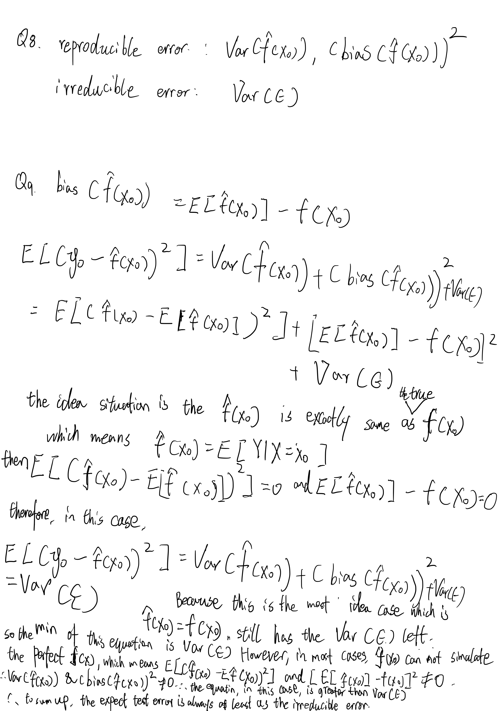

```{r setup, include=FALSE}
knitr::opts_chunk$set(echo = TRUE, message = FALSE,
                      warning = FALSE)
```

```{r data}
library(readr)
library(ggplot2)
library(tidyverse)
library(tidymodels)
library(corrplot)
library(ggthemes)
tidymodels_prefer()
data = read_csv(file = 'data/abalone.csv')
head(data)
```
## Linear Regression

For this lab, we will be working with a data set from the UCI (University of California, Irvine) Machine Learning repository ([see website here](http://archive.ics.uci.edu/ml/datasets/Abalone)). The full data set consists of $4,177$ observations of abalone in Tasmania. (Fun fact: [Tasmania](https://en.wikipedia.org/wiki/Tasmania "Tasmania") supplies about $25\%$ of the yearly world abalone harvest.)

{width="152"}

The age of an abalone is typically determined by cutting the shell open and counting the number of rings with a microscope. The purpose of this data set is to determine whether abalone age (**number of rings + 1.5**) can be accurately predicted using other, easier-to-obtain information about the abalone.

The full abalone data set is located in the `\data` subdirectory. Read it into *R* using `read_csv()`. Take a moment to read through the codebook (`abalone_codebook.txt`) and familiarize yourself with the variable definitions.

Make sure you load the `tidyverse` and `tidymodels`!

### Question 1

Your goal is to predict abalone age, which is calculated as the number of rings plus 1.5. Notice there currently is no `age` variable in the data set. Add `age` to the data set.

Assess and describe the distribution of `age`.
```{r q1}
age <- data$rings + 1.5
data$age <- age
head(data)
```
### Question 2

Split the abalone data into a training set and a testing set. Use stratified sampling. You should decide on appropriate percentages for splitting the data.

*Remember that you'll need to set a seed at the beginning of the document to reproduce your results.*
```{r q2}
set.seed(12)
split <- initial_split(data, prop = 0.80,
                               strata = NULL)
train <- training(split)
test <- testing(split)
head(train)
head(test)
```
### Question 3

Using the **training** data, create a recipe predicting the outcome variable, `age`, with all other predictor variables. Note that you should not include `rings` to predict `age`. Explain why you shouldn't use `rings` to predict `age`.

Steps for your recipe:

1.  dummy code any categorical predictors

2.  create interactions between

    -   `type` and `shucked_weight`,
    -   `longest_shell` and `diameter`,
    -   `shucked_weight` and `shell_weight`

3.  center all predictors, and

4.  scale all predictors.

You'll need to investigate the `tidymodels` documentation to find the appropriate step functions to use.

Answer: because rings and age are highly correlated to(depends on) each other since age = rings + 1.5. rings will be he only factor will affect the result of age if we add rings in there.
```{r q3}
library(recipes)
fol <- recipe (age ~ type + longest_shell + diameter + height + whole_weight + shucked_weight + viscera_weight + shell_weight , train) %>% step_dummy(all_nominal_predictors()) %>% 
  step_interact(terms = ~starts_with('type'):shucked_weight) %>% 
  step_interact(terms = ~ longest_shell:diameter) %>% 
  step_interact(terms = ~ shucked_weight:shell_weight) %>% 
  step_center(all_predictors()) %>% 
  step_scale(all_predictors())
  
```
### Question 4

Create and store a linear regression object using the `"lm"` engine.
```{r q4}
lm_model <- linear_reg() %>% 
  set_engine("lm")
```
### Question 5

Now:

1.  set up an empty workflow,
2.  add the model you created in Question 4, and
3.  add the recipe that you created in Question 3.
```{r q5}
lm_wflow <- workflow() %>%
  add_model(lm_model) %>%
  add_recipe(fol)
```
### Question 6

Use your `fit()` object to predict the age of a hypothetical female abalone with longest_shell = 0.50, diameter = 0.10, height = 0.30, whole_weight = 4, shucked_weight = 1, viscera_weight = 2, shell_weight = 1.
```{r q6}
lm_fit <- fit(lm_wflow, train)
res <- predict(lm_fit, new_data = data.frame(type = 'F', longest_shell = 0.50, diameter = 0.10, height = 0.30, whole_weight = 4, shucked_weight = 1, viscera_weight = 2, shell_weight = 1))
res
```
### Question 7

Now you want to assess your model's performance. To do this, use the `yardstick` package:

1.  Create a metric set that includes *R^2^*, RMSE (root mean squared error), and MAE (mean absolute error).
2.  Use `predict()` and `bind_cols()` to create a tibble of your model's predicted values from the **training data** along with the actual observed ages (these are needed to assess your model's performance).
3.  Finally, apply your metric set to the tibble, report the results, and interpret the *R^2^* value.

```{r q7}
abalone_metrics <- metric_set(rmse, rsq, mae)
abalone_train_res <- predict(lm_fit, new_data = train %>% select(-age))
abalone_train_res <- bind_cols(abalone_train_res, train %>% select(age))
abalone_metrics(abalone_train_res, truth = age, 
                estimate = .pred)
```
Answer: $R^2$ proportion of the variability in Y(response) that can be explained using X(dependent). it also means how well the model fits in the data. 
since R-squared value 0.5 < r(0.56) < 0.7 this value is generally considered a Moderate effect size. $R^2$ will always increase as more predictors are added to the model. it favor flexible methods, which may overfit the data. 

### Required for 231 Students



